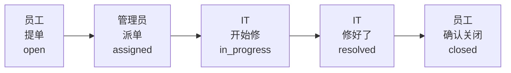
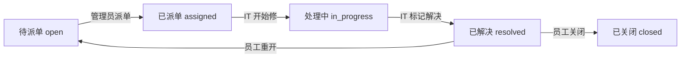

# 三个角色各干什么

关联：[需求与角色](./01-requirements-and-roles.md) · [数据库](./02-database.md) · [项目结构与接口](./03-architecture-and-api.md)

本文对应 Cursor 里的 Ticket Roles 画布：同一份角色总览，用 Markdown 保存在仓库 `docs/` 里，可以进 git、可以离线看。画布只能在 Cursor 编辑器里打开，不能当作项目文档提交。

---

这不是图书管理系统。没有「书」这种档案可以增删改查。系统里流转的是一张报修单：员工提单，管理员派给 IT，IT 修好，员工确认关闭。

| 角色 | 一句话 |
|---|---|
| `user` 员工 | 只提单、看自己的单 |
| `agent` IT | 只修派给自己的单 |
| `admin` 主管 | 派单、看全部 |

先建立这张图：**三个角色不是三套系统，是同一张工单上的三种人。** 员工看不见别人的单，IT 看不见没派给自己的单，只有管理员能把单子交到某位 IT 手上。

---

## 一张工单怎么走完

从左到右是时间。每一格是「谁做了什么」，以及工单变成什么状态。

| 顺序 | 谁来做 | 动作 | 工单状态变成 | 其他人此时怎样 |
|---|---|---|---|---|
| 1 | 员工 | 提交报修 | `open` | IT 还看不到这张单 |
| 2 | 管理员 | 指派给某位 IT | `assigned` | 被指派的 IT 开始能看到 |
| 3 | IT 处理人 | 开始处理 | `in_progress` | 员工能看到进度并评论 |
| 4 | IT 处理人 | 标记已解决 | `resolved` | 等员工确认 |
| 5 | 员工 | 关闭或重开 | `closed` / 回到 `open` | 关闭后谁都不能再改 |

---

## 状态只能按规定跳

员工不能把一张刚提交的单直接标成「已解决」。每条箭头旁边是允许操作的人。

---

## 员工 `user`

电脑坏了、账号登不上、网络连不上的普通同事。只关心「我的问题修了没」。

只能看到自己提交的工单。别人的单对 TA 来说不存在（接口返回 404）。

操作顺序：

1. 注册 / 登录
2. 填写标题、分类、描述，提交工单（状态变成 `open`）
3. 等待管理员派单、IT 处理；期间可以看进度、追加评论
4. IT 标记 `resolved` 后：关闭（`closed`）或重开（回到 `open`）

| 能做 | 不能做 |
|---|---|
| 提交新工单 | 查看或评论别人的工单 |
| 查看、评论自己的工单 | 把工单指派给 IT |
| 已解决后关闭或重开 | 把工单标成处理中 / 已解决 |

---

## IT 处理人 `agent`

真正修电脑、开账号、查网络的人。只处理「派到我手上」的单。

管理员指派给自己的工单能看；没派给自己的看不到。自己当员工提的单也能看。

操作顺序：

1. 登录后，列表里只有派给自己的单
2. 点「开始处理」（`assigned` → `in_progress`）
3. 边修边评论，和员工沟通
4. 修好后标记「已解决」（`in_progress` → `resolved`），等员工确认关闭

| 能做 | 不能做 |
|---|---|
| 员工能做的全部事情（自己也能提单） | 查看未指派给自己的工单 |
| 开始处理指派给自己的单 | 把单子派给同事（只有管理员能派） |
| 在自己的单上评论、标记已解决 | 关闭别人提的单（关闭是提单人确认修好） |

---

## 管理员 `admin`

IT 主管。不管具体修哪台电脑，负责把待处理的单派出去，并看全局。

能看全部工单、全部用户。是唯一能「派活」的人。

操作顺序：

1. 登录后看到所有 `open` 工单
2. 选一个 `agent`，执行指派（`open` → `assigned`）
3. 必要时可代为改状态、重新指派
4. 查看用户列表，确认谁是 `agent`

| 能做 | 不能做 |
|---|---|
| 查看全部工单 | 把工单指派给普通员工（只能派给 `agent`） |
| 把工单指派给任意 `agent` | 第一期不能禁用账号、不能上传附件、不发邮件 |
| 对未关闭工单改状态 / 重新指派 | |
| 查看用户列表 | |
