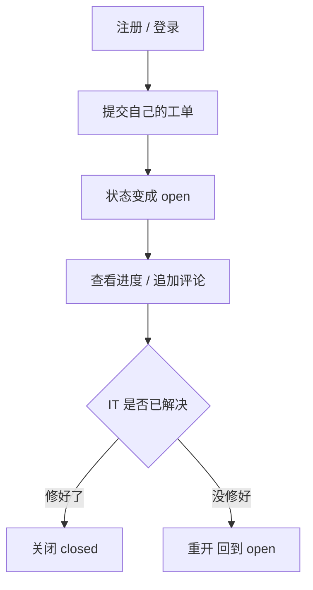
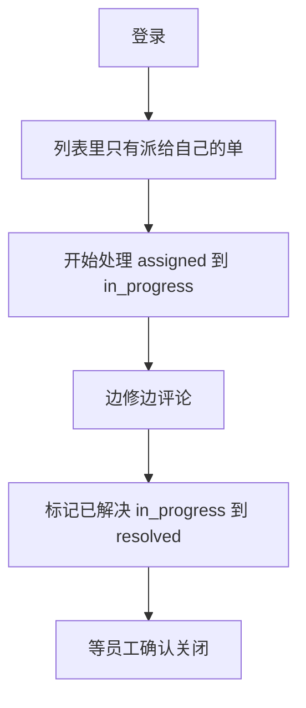
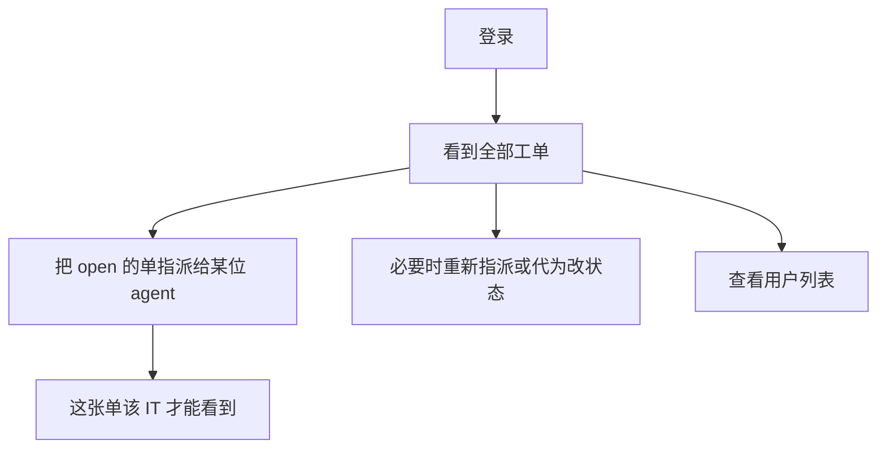

# 需求与角色

关联：[三个角色各干什么](./00-roles-overview.md) · [数据库](./02-database.md) · [项目结构与接口](./03-architecture-and-api.md)

角色总览图（一张单怎么走、三种人能做什么）见 [00-roles-overview.md](./00-roles-overview.md)。本文写规则、范围和验收。

| 项 | 内容 |
|---|---|
| 产品 | 企业内部 IT 工单管理系统 |
| 项目代号 | it-ticket-api |
| 形态 | 纯后端 HTTP API（第一期不写前端） |
| 技术 | Go + Gin + MySQL |

---

## 1. 为什么做这个

图书管理系统本质是「资源档案的增删改查」。`gin-demo` 已经覆盖列表、详情、创建、更新、删除和简单 token。再做一套借还书，增量很小。

本项目要练的是后台岗位更常见的能力：

- 登录鉴权（JWT）
- 按角色控制「能看到哪些数据」
- 业务状态只能按规定流转
- 改库带事务（改状态和写审计必须一起成功或一起失败）
- 列表分页、筛选、统一错误码

因此选型为：**企业内部 IT 支持工单后台**。员工提单，IT 处理，管理员看全局并派单。

---

## 2. 目标与非目标

### 2.1 目标

员工遇到电脑、账号、网络等问题时提交工单；IT 人员处理被指派的单；管理员查看全部工单并派人。系统保证三件事可追溯：

1. 谁能看什么
2. 工单现在处于哪一步
3. 每一步是谁改的

### 2.2 第一期明确不做

- 完整商城、支付、库存、物流
- 通用「菜单树 + 按钮权限」低代码后台
- 前端页面、文件附件、邮件 / IM 通知
- WebSocket、消息队列、微服务拆分
- SLA 计时、知识库、自动分派算法

---

## 3. 三种角色

角色存在 `users.role` 字段上。第一期不上独立角色表，不上菜单权限树。

| 角色 | 谁 | 一句话 |
|---|---|---|
| `user` | 普通员工 | 只关心「我的问题修了没」 |
| `agent` | IT 处理人 | 只修「派到我手上」的单 |
| `admin` | 管理员 | 不管修电脑，负责派活、看全局 |

三个角色不是三套系统，是**同一张报修单上的三种人**。

记住这一句：员工看不见别人的单，IT 看不见没派给自己的单，只有管理员能把单交到某位 IT 手上。

### 3.1 员工 `user`

电脑坏了、账号登不上、网络连不上的普通同事。



| 能做 | 不能做 |
|---|---|
| 注册登录 | 查看或评论别人的工单 |
| 提交新工单 | 把工单指派给 IT |
| 查看、评论**自己的**工单 | 把工单标成处理中 / 已解决 |
| 已解决后关闭或重开 | |

别人的工单对 TA 来说不存在：用别人的 id 查详情，返回 **404**（不要 403，避免泄露单子是否存在）。

### 3.2 IT 处理人 `agent`

真正修电脑、开账号、查网络的人。



| 能做 | 不能做 |
|---|---|
| 员工能做的全部（自己也能提单） | 查看未指派给自己的工单（404） |
| 对自己的单：开始处理、评论、标记已解决 | 把单子派给同事（只有管理员能派） |
| | 关闭别人提的单（关闭是提单人确认） |

### 3.3 管理员 `admin`

IT 主管。第一期用环境变量 bootstrap 一个管理员账号（启动时若不存在则创建），否则没人能派单。



| 能做 | 不能做 |
|---|---|
| 查看全部工单 | 把工单指派给普通员工（只能派给 `agent`） |
| 指派给任意 `agent` | 第一期不能禁用账号 |
| 对未关闭工单改状态 / 重新指派 | |
| 查看用户列表 | |

注册接口不允许客户端指定自己是 `admin` / `agent`。新用户默认都是 `user`。

---

## 4. 一张工单怎么走完


| 顺序 | 谁 | 动作 | 工单状态 | 其他人此时怎样 |
|---|---|---|---|---|
| 1 | 员工 | 提交报修 | `open` | IT 还看不到这张单 |
| 2 | 管理员 | 指派给某位 IT | `assigned` | 被指派的 IT 开始能看到 |
| 3 | IT 处理人 | 开始处理 | `in_progress` | 员工能看进度并评论 |
| 4 | IT 处理人 | 标记已解决 | `resolved` | 等员工确认 |
| 5 | 员工 | 关闭或重开 | `closed` / 回到 `open` | 关闭后谁都不能再改 |

验收必须用 curl 跑通的主路径：

```text
注册(user) → 登录 → 创建工单
  → 管理员登录 → 指派给 agent
  → agent 登录 → 开始处理 → 评论 → 标记已解决
  → user 登录 → 关闭工单
```

---

## 5. 状态机（必须严格执行）

允许的状态：`open`、`assigned`、`in_progress`、`resolved`、`closed`。

```text
open ──assign──► assigned ──start──► in_progress ──resolve──► resolved ──close──► closed
  ▲                  │                    │                      │
  │                  └──── 仅 admin 可重新指派 ──┘                      │
  └──────────────────────── reopen ──────────────────────────────────┘
```

| 当前状态 | 动作 | 下一状态 | 谁可以操作 |
|---|---|---|---|
| `open` | 指派 | `assigned` | 仅 `admin` |
| `assigned` | 开始处理 | `in_progress` | 当前处理人或 `admin` |
| `assigned` | 重新指派 | `assigned`（换处理人） | 仅 `admin` |
| `in_progress` | 标记已解决 | `resolved` | 当前处理人或 `admin` |
| `in_progress` | 重新指派 | `assigned` | 仅 `admin` |
| `resolved` | 关闭 | `closed` | 创建人或 `admin` |
| `resolved` | 重新打开 | `open`（处理人清空） | 创建人或 `admin` |
| `closed` | — | 禁止任何状态变更和评论 | — |

规则：

- 改状态只接受「动作」，不允许客户端直接写 `status` 字段
- 非法流转：HTTP 409，错误码 `TICKET_INVALID_TRANSITION`
- `closed` 后评论或再改状态：HTTP 409，错误码 `TICKET_CLOSED`
- 每次合法状态变更必须写审计，和改工单在同一事务里

---

## 6. 功能范围

优先级：P0 第一期必须完成；P1 有时间再做；P2 第一期禁止开工。

### 6.1 账号 P0

- 注册：email + password + 显示名；email 唯一；默认角色 `user`
- 登录：校验密码，返回 JWT 和用户信息
- 除注册、登录、健康检查外，请求头带 `Authorization: Bearer <token>`
- 密码用 bcrypt；响应永不返回密码哈希
- 密码长度 8～72；email 需基本格式正确

### 6.2 工单 P0

- 创建：标题、描述、分类必填。分类枚举：`hardware` / `software` / `network` / `other`
- 详情：含状态、创建人、处理人、评论、审计时间线
- 列表：分页；可按 `status`、`category`、标题关键词筛；默认按 `updated_at` 倒序
- `page` 从 1 开始，默认 1；`page_size` 默认 20，最大 50
- 列表和详情按角色过滤数据范围，禁止靠前端藏接口
- 指派、按动作改状态、评论（`closed` 不可评）

### 6.3 审计 P0

创建、指派、状态变更、重新打开都必须写 `audit_logs`。评论本身不写审计（评论表已是记录）。

### 6.4 管理端

| 编号 | 需求 | 优先级 |
|---|---|---|
| 用户列表 | 仅 admin；分页；不返回密码 | P0 |
| 将用户设为 agent | 仅 admin；不可改掉最后一个 admin | P1 |
| 全量工单筛选 | admin 可按 `assignee_id` 筛 | P0 |

### 6.5 P2（第一期禁止开工）

附件上传、邮件通知、满意度评分、仪表盘、导出 Excel、多租户 / 部门树、完整 RBAC 菜单。

---

## 7. 验收标准（第一期做完的定义）

1. 按仓库 README 能从零启动（建库、跑迁移、启动进程）
2. curl 能走完第 4 节主路径
3. `user` 用别人的工单 id 访问详情，得到 404
4. `user` 调用指派接口，得到 403
5. `open` 状态直接 `resolve`，得到 409
6. 每次合法状态变更，数据库里工单行和审计行一起出现
7. 至少有状态机的表驱动测试，以及「不可见则 404」的测试

---

## 8. 开发分期

| 阶段 | 范围 | 完成标志 |
|---|---|---|
| 第 1 周 | 骨架、配置、MySQL、注册登录、JWT、`/me` | 能拿到 token 调 `/me` |
| 第 2 周 | 创建工单、列表分页、详情、角色数据范围 | user 只能看到自己的单 |
| 第 3 周 | 指派、状态机、评论、审计事务 | 主路径 + 非法流转测试通过 |
| 第 4 周 | 用户列表、README、失败用例补齐 | 第 7 节验收全部打勾 |

第 4 周之后若继续：P1 设为 agent → Redis 缓存列表 → 乐观锁防并发改状态。每次只加一项。
