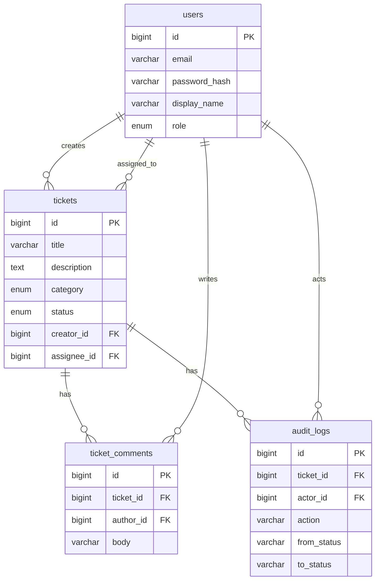

# 数据库

关联：[需求与角色](./01-requirements-and-roles.md) · [项目结构与接口](./03-architecture-and-api.md)

第一期：**1 个库、4 张表**。用户、工单、评论、审计必须在同一库，因为改状态和写审计要走同一个事务。不上 Redis，不拆第二个业务库。

---

## 1. 库

| 项 | 值 |
|---|---|
| 库名 | `it_ticket` |
| 引擎 | InnoDB |
| 字符集 | `utf8mb4` |
| 排序规则 | `utf8mb4_unicode_ci` |

建库：

```sql
CREATE DATABASE IF NOT EXISTS it_ticket
  DEFAULT CHARACTER SET utf8mb4
  DEFAULT COLLATE utf8mb4_unicode_ci;
```

表结构用 `sql/` 下的迁移文件管理，进程启动时**不要**自动建表。

---

## 2. 表一览

| 表名 | 存什么 | 对应谁 |
|---|---|---|
| `users` | 账号、密码哈希、角色 | 员工 / IT / 管理员都在这张表 |
| `tickets` | 一张报修单 | 标题、分类、状态、创建人、处理人 |
| `ticket_comments` | 单子上的留言 | 员工和 IT 沟通 |
| `audit_logs` | 谁在什么时候改了状态 | 可追溯 |

角色、分类、状态都是字段上的枚举，**不单独建表**。登录用 JWT，服务端不存会话，**没有 `sessions` 表**。

关系：

```text
users 1 ──< tickets          （creator_id / assignee_id）
tickets 1 ──< ticket_comments
tickets 1 ──< audit_logs
users 1 ──< ticket_comments  （author_id）
users 1 ──< audit_logs       （actor_id）
```



---

## 3. `users` — 用户

三种角色共用一张表，用 `role` 区分。

| 字段 | 类型 | 约束 | 说明 |
|---|---|---|---|
| `id` | BIGINT | PK，自增 | 用户 ID |
| `email` | VARCHAR(255) | 非空，唯一 | 登录名 |
| `password_hash` | VARCHAR(255) | 非空 | bcrypt 哈希，接口永不返回 |
| `display_name` | VARCHAR(64) | 非空 | 显示名 |
| `role` | ENUM('user','agent','admin') | 非空，默认 `user` | 角色 |
| `created_at` | DATETIME | 非空 | 注册时间 |
| `updated_at` | DATETIME | 非空 | 更新时间 |

| 角色值 | 含义 |
|---|---|
| `user` | 普通员工 |
| `agent` | IT 处理人 |
| `admin` | 管理员 |

索引：主键；`email` 唯一索引。

---

## 4. `tickets` — 工单

一张报修单一行。处理人未派时 `assignee_id` 为空。

| 字段 | 类型 | 约束 | 说明 |
|---|---|---|---|
| `id` | BIGINT | PK，自增 | 工单 ID |
| `title` | VARCHAR(120) | 非空 | 标题 |
| `description` | TEXT | 非空 | 描述 |
| `category` | ENUM('hardware','software','network','other') | 非空 | 分类 |
| `status` | ENUM('open','assigned','in_progress','resolved','closed') | 非空，默认 `open` | 状态 |
| `creator_id` | BIGINT | 非空，FK → `users.id` | 提单人 |
| `assignee_id` | BIGINT | 可空，FK → `users.id` | 处理人 |
| `created_at` | DATETIME | 非空 | 创建时间 |
| `updated_at` | DATETIME | 非空 | 最后更新；列表默认按它倒序 |

| `category` | 含义 |
|---|---|
| `hardware` | 电脑设备 |
| `software` | 软件账号 |
| `network` | 网络 |
| `other` | 其他 |

| `status` | 含义 | 谁推到这一步 |
|---|---|---|
| `open` | 待派单 | 员工提单，或重开后 |
| `assigned` | 已派单 | 管理员指派 |
| `in_progress` | 处理中 | 当前 IT 或管理员 |
| `resolved` | 已解决 | 当前 IT 或管理员 |
| `closed` | 已关闭 | 提单人或管理员 |

索引：

- `(status, updated_at)` — 按状态列表
- `(creator_id, updated_at)` — 员工看自己的单
- `(assignee_id, updated_at)` — IT 看派给自己的单

数据范围（查库时就要过滤，不是只在 handler 里判断）：

| 角色 | 能查到的工单 |
|---|---|
| `user` | `creator_id = 当前用户` |
| `agent` | `assignee_id = 当前用户`（自己提的单也算员工能力，实现时：自己创建的 **或** 派给自己的） |
| `admin` | 全部 |

`agent` 同时具备员工能力：可以看到「我创建的」以及「派给我的」。

---

## 5. `ticket_comments` — 评论

| 字段 | 类型 | 约束 | 说明 |
|---|---|---|---|
| `id` | BIGINT | PK，自增 | 评论 ID |
| `ticket_id` | BIGINT | 非空，FK → `tickets.id` | 所属工单 |
| `author_id` | BIGINT | 非空，FK → `users.id` | 作者 |
| `body` | VARCHAR(2000) | 非空 | 正文 |
| `created_at` | DATETIME | 非空 | 评论时间 |

工单 `closed` 后禁止再插入。评论本身不写 `audit_logs`。

建议索引：`(ticket_id, created_at)`，详情页按时间拉评论。

---

## 6. `audit_logs` — 审计

| 字段 | 类型 | 约束 | 说明 |
|---|---|---|---|
| `id` | BIGINT | PK，自增 | 审计 ID |
| `ticket_id` | BIGINT | 非空，FK → `tickets.id` | 所属工单 |
| `actor_id` | BIGINT | 非空，FK → `users.id` | 操作人 |
| `action` | VARCHAR(32) | 非空 | 动作 |
| `from_status` | VARCHAR(32) | 可空 | 原状态；创建时为空 |
| `to_status` | VARCHAR(32) | 非空 | 新状态 |
| `created_at` | DATETIME | 非空 | 操作时间 |

`action` 只允许：

| action | 何时写入 |
|---|---|
| `create` | 员工提单 |
| `assign` | 管理员指派 / 重新指派 |
| `start` | 开始处理 |
| `resolve` | 标记已解决 |
| `close` | 关闭 |
| `reopen` | 重开 |

写入规则：工单行的 `UPDATE`/`INSERT` 和本表 `INSERT` 必须在**同一事务**。只改成功一半视为失败。

建议索引：`(ticket_id, created_at)`。

---

## 7. 建表 SQL（第一期）

实现时放到 `sql/001_init.sql`，与本文保持一致。

```sql
CREATE TABLE users (
  id             BIGINT PRIMARY KEY AUTO_INCREMENT,
  email          VARCHAR(255) NOT NULL,
  password_hash  VARCHAR(255) NOT NULL,
  display_name   VARCHAR(64)  NOT NULL,
  role           ENUM('user','agent','admin') NOT NULL DEFAULT 'user',
  created_at     DATETIME NOT NULL DEFAULT CURRENT_TIMESTAMP,
  updated_at     DATETIME NOT NULL DEFAULT CURRENT_TIMESTAMP ON UPDATE CURRENT_TIMESTAMP,
  UNIQUE KEY uk_users_email (email)
);

CREATE TABLE tickets (
  id           BIGINT PRIMARY KEY AUTO_INCREMENT,
  title        VARCHAR(120) NOT NULL,
  description  TEXT         NOT NULL,
  category     ENUM('hardware','software','network','other') NOT NULL,
  status       ENUM('open','assigned','in_progress','resolved','closed') NOT NULL DEFAULT 'open',
  creator_id   BIGINT NOT NULL,
  assignee_id  BIGINT NULL,
  created_at   DATETIME NOT NULL DEFAULT CURRENT_TIMESTAMP,
  updated_at   DATETIME NOT NULL DEFAULT CURRENT_TIMESTAMP ON UPDATE CURRENT_TIMESTAMP,
  CONSTRAINT fk_tickets_creator  FOREIGN KEY (creator_id)  REFERENCES users(id),
  CONSTRAINT fk_tickets_assignee FOREIGN KEY (assignee_id) REFERENCES users(id),
  KEY idx_tickets_status_updated   (status, updated_at),
  KEY idx_tickets_creator_updated  (creator_id, updated_at),
  KEY idx_tickets_assignee_updated (assignee_id, updated_at)
);

CREATE TABLE ticket_comments (
  id         BIGINT PRIMARY KEY AUTO_INCREMENT,
  ticket_id  BIGINT       NOT NULL,
  author_id  BIGINT       NOT NULL,
  body       VARCHAR(2000) NOT NULL,
  created_at DATETIME     NOT NULL DEFAULT CURRENT_TIMESTAMP,
  CONSTRAINT fk_comments_ticket FOREIGN KEY (ticket_id) REFERENCES tickets(id),
  CONSTRAINT fk_comments_author FOREIGN KEY (author_id) REFERENCES users(id),
  KEY idx_comments_ticket_created (ticket_id, created_at)
);

CREATE TABLE audit_logs (
  id          BIGINT PRIMARY KEY AUTO_INCREMENT,
  ticket_id   BIGINT      NOT NULL,
  actor_id    BIGINT      NOT NULL,
  action      VARCHAR(32) NOT NULL,
  from_status VARCHAR(32) NULL,
  to_status   VARCHAR(32) NOT NULL,
  created_at  DATETIME    NOT NULL DEFAULT CURRENT_TIMESTAMP,
  CONSTRAINT fk_audit_ticket FOREIGN KEY (ticket_id) REFERENCES tickets(id),
  CONSTRAINT fk_audit_actor  FOREIGN KEY (actor_id)  REFERENCES users(id),
  KEY idx_audit_ticket_created (ticket_id, created_at)
);
```

---

## 8. 第一期不要建的表

| 不要建 | 原因 |
|---|---|
| `roles` / `permissions` / `menus` | 三种角色写在 `users.role` 即可 |
| `categories` | 分类是工单字段枚举 |
| `ticket_status` | 状态是工单字段枚举 |
| `sessions` | JWT 无状态，不入库 |
| `attachments` / `notifications` | P2，第一期禁止开工 |

P1「把用户设为 agent」只 `UPDATE users.role`，不加表。

---

## 9. V2 P0 增量

不加表。已有库执行 `sql/002_v2.sql`；新库用更新后的 `001_init.sql`。

| 表 | 列 | 说明 |
|---|---|---|
| `tickets` | `closed_at DATETIME NULL` | 关闭或撤回时写入；重开清掉。用来算 7 天重开窗口 |
| `audit_logs` | `reason VARCHAR(500) NULL` | 重开 / 管理员代关 / 撤回原因 |

`audit_logs.action` 增加：`claim`（自领）、`cancel`（撤回）。

`pending`、`users.status`、`tickets.priority`、`notifications` 见 `sql/003_p1.sql`。`notifications.ticket_id` 可空（角色 / 账号通知没有工单），已有库再执行 `sql/004_notify.sql`。附件表不做。

---

## 10. `account_audits` — 账号变更审计

管理员改角色、停用 / 启用账号时写入。已有库执行 `sql/005_activity.sql`。

| 列 | 类型 | 说明 |
|---|---|---|
| `id` | BIGINT PK | 自增 |
| `actor_id` | BIGINT | 操作的管理员 |
| `user_id` | BIGINT | 被改的人 |
| `action` | VARCHAR(32) | `role` / `status` |
| `from_value` | VARCHAR(32) NULL | 改之前 |
| `to_value` | VARCHAR(32) | 改之后 |
| `created_at` | DATETIME | 写入时间 |

全局审计接口把 `audit_logs` 和这张表拼在一起。

---

## 11. `invite_codes` — 注册邀请码

公开注册关闭后，管理员生成邀请码。已有库执行 `sql/006_invite.sql`。

| 列 | 类型 | 说明 |
|---|---|---|
| `id` | BIGINT PK | 自增 |
| `code` | VARCHAR(32) UNIQUE | 8 位，去掉易混字符 |
| `created_by` | BIGINT | 生成的管理员 |
| `expires_at` | DATETIME | 生成后 24 小时 |
| `used_at` / `used_by` | DATETIME / BIGINT NULL | 注册成功时写入，一码一次 |

---

## 12. `ticket_templates` / `canned_replies` — 提单模板与常用回复

原先写死在代码里的打印机 / 邮箱 / 网络模板和 6 条常用回复，改为入库。已有库执行 `sql/007_catalog.sql`（空表时写入上述种子数据）。

### `ticket_templates`

| 列 | 类型 | 说明 |
|---|---|---|
| `id` | BIGINT PK | 自增 |
| `name` | VARCHAR(32) | 卡片上的名称 |
| `category` | ENUM | 与工单分类相同 |
| `title_hint` | VARCHAR(120) | 点选后填进标题 |
| `hint` | VARCHAR(80) | 卡片说明 |
| `icon` | VARCHAR(16) | `printer` / `email` / `network` / `other` |
| `sort_order` | INT | 越小越靠前 |
| `enabled` | TINYINT(1) | 停用后公开列表不返回 |
| `fields` | JSON | `[{ key, label, placeholder, required }]`，1～8 个 |

公开 `GET /ticket-templates` 只返回 `enabled=1`。管理员 CRUD 在 `/api/v1/admin/ticket-templates`。最多 20 行。

### `canned_replies`

| 列 | 类型 | 说明 |
|---|---|---|
| `id` | BIGINT PK | 自增 |
| `title` | VARCHAR(80) | 下拉显示 |
| `body` | VARCHAR(2000) | 插入评论框的正文 |
| `sort_order` | INT | 越小越靠前 |
| `enabled` | TINYINT(1) | 停用后 IT 评论框不出现 |

公开 `GET /canned-replies` 只返回启用的。管理员 CRUD 在 `/api/v1/admin/canned-replies`。最多 30 行。删除模板或回复不影响已经写进工单的文本。
