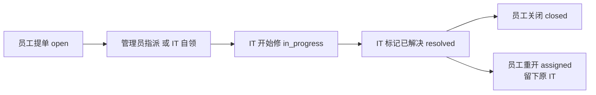

# V2 产品说明

关联：[V1 需求与角色](./01-requirements-and-roles.md) · [三个角色各干什么](./00-roles-overview.md) · [V2 接口](./05-v2-api.md)

V1 文档（00～03）描述第一期合同。V2 P0 已按本文和 [05-v2-api.md](./05-v2-api.md) 落到后台；P1 / P2 还没做。接口以 05 和现网路由为准。

| 项 | 内容 |
|---|---|
| 产品 | 企业内部 IT 工单 |
| 版本 | V2 |
| 相对 V1 | 不换角色模型，不拆第二套系统。修主流程断点，再补可用性 |

---

## 1. 为什么做 V2

V1 练的是鉴权、角色可见范围、状态机、事务审计。主路径能走通：

```text
员工提单 → 管理员派单 → IT 处理 → 员工确认关闭
```

按真实报修来用，有两处会把单子打回原点：

1. 每张单都必须管理员手派。IT 看不见待派池，也不能自己领。管理员不在，整条链停住。
2. 员工说「没修好」后，处理人被清空，单子退回待派。同一问题当新单再走一遍。

另外：审计写了页面上看不到；列表没有筛选分页；工单里只有用户 id；改角色要等 JWT 过期才生效。

V2 先把这些闭环修完。不把系统做成通用低代码后台，也不上微服务。

---

## 2. 目标与非目标

### 2.1 目标

1. IT 能看到待派池并自领；管理员仍可指定或改派。
2. 重开留下原处理人，并写下原因。
3. 员工能撤回错单；关单后在宽限期内还能重开。
4. 详情能看见「谁在什么时候做了什么」。
5. 改角色立即生效；列表能按状态、分类、关键词工作。
6. IT 的「我报的」和「我修的」分开。

### 2.2 非目标（V2 仍然不做）

- 邮件 / IM 外发、WebSocket
- SLA 计时、知识库、自动分派算法
- 满意度评分、导出 Excel、仪表盘大屏
- 多租户 / 部门树、完整菜单权限
- 支付、库存、通用工作流引擎

这些要等闭环和优先级稳定后再开。

---

## 3. V1 保留什么

下面这些不要改掉：

- 三种角色仍是 `user` / `agent` / `admin`，写在 `users.role` 上
- 同一套工单接口，按角色缩小可见范围；看不见返回 **404**，不返回 403
- 改状态只传「动作」，客户端不能直接写 `status`
- 创建、指派、状态变更必须写审计，和改工单同一事务
- 注册不能自封 `admin` / `agent`
- 不能派给普通员工，只能派给 `agent`
- 密码 bcrypt；响应不返回密码哈希

---

## 4. 角色在 V2 里多了什么

三个角色还是同一张单上的三种人。变的是 **IT 能看见待派池**，以及 **员工能结束一张还没修好的单**。

| 角色 | V1 | V2 增加 |
|---|---|---|
| `user` 员工 | 提单、看自己的单、评论、关闭 / 重开 | 待派时可撤回；关单 7 天内可重开；重开必填原因 |
| `agent` IT | 只看「派给我的 + 我提的」 | 能看待派池并自领；「待我处理」和「我提交的」分开；P1 可转派、可标记等用户 |
| `admin` 管理员 | 看全部、派单、改状态、看用户 | 派单不再是唯一入口；代关必须写原因；改角色立即生效 |



---

## 5. 一张工单怎么走完

主路径（管理员仍可派，IT 也可以领）：

| 顺序 | 谁 | 动作 | 状态变成 | 其他人此时怎样 |
|---|---|---|---|---|
| 1 | 员工 | 提交报修 | `open` | 进入待派池，所有 IT 和管理员能看见 |
| 2 | 管理员指派，或某位 IT 自领 | 指定处理人 | `assigned` | 只有处理人、提单人、管理员能继续操作 |
| 3 | 当前 IT | 开始处理 | `in_progress` | 员工能看进度、能评论 |
| 4 | 当前 IT | 标记已解决 | `resolved` | 等员工确认 |
| 5 | 员工 | 关闭 | `closed` | 7 天内可重开；之后只读 |

分叉：

| 情况 | 谁 | 结果 |
|---|---|---|
| 提单后发现提错了 | 员工 | `cancel`，单子关闭，审计记撤回 |
| 没修好 | 员工或管理员 | `reopen`，回到 `assigned`，**留下原处理人** |
| 关早了 | 员工或管理员 | 关闭后 7 天内同样 `reopen` |
| 派错人 / IT 忙不过来 | 管理员随时改派；P1 起当前 IT 可转派 | 状态回到 `assigned`，换处理人 |
| 管理员代员工关闭 | 管理员 | 必须写原因，审计能看出来不是员工本人确认 |

验收必须能 curl 跑通的主路径：

```text
注册(user) → 登录 → 创建工单
  → agent 登录 → 在待派池看见这张单 → 自领 → 开始处理 → 评论 → 标记已解决
  → user 登录 → 重开（处理人还在）→ agent 再标记已解决
  → user 登录 → 关闭工单
```

管理员派单这条旧主路径仍然要通，作为自领的并列入口。

---

## 6. 状态机

允许的状态（P0）：`open`、`assigned`、`in_progress`、`resolved`、`closed`。

P1 再加 `pending`（等用户补充）。P0 不要先改枚举。

```text
open ──assign / claim──► assigned ──start──► in_progress ──resolve──► resolved ──close──► closed
 ▲                         │                      │                      │                  │
 │                         └──── assign / transfer（换人，回到 assigned）──┘                  │
 │                                                                                           │
 └── cancel（创建人撤回，直接 closed）                                                        │
                                                                                             │
 resolved ──reopen──► assigned（保留处理人）                                                 │
 closed   ──reopen──► assigned（关闭后 7 天内，保留处理人）◄──────────────────────────────────┘
```

| 当前状态 | 动作 | 下一状态 | 谁可以 | 备注 |
|---|---|---|---|---|
| `open` | `assign` | `assigned` | 仅 `admin` | 指定一位 `agent` |
| `open` | `claim` | `assigned` | 任意 `agent` 或 `admin` | 自领；已有人领了则 409 |
| `open` | `cancel` | `closed` | 创建人 | 错单撤回 |
| `assigned` | `start` | `in_progress` | 当前处理人或 `admin` | |
| `assigned` / `in_progress` | `assign` | `assigned` | 仅 `admin` | 改派 |
| `in_progress` | `resolve` | `resolved` | 当前处理人或 `admin` | |
| `resolved` | `close` | `closed` | 创建人或 `admin` | 管理员代关必须写 `reason` |
| `resolved` | `reopen` | `assigned` | 创建人或 `admin` | **不清空处理人**；必须写 `reason` |
| `closed` | `reopen` | `assigned` | 创建人或 `admin` | 仅 `closed_at` 起 7 天内；必须写 `reason` |
| `closed` | 其它 | — | — | 评论、指派、自领一律 409 |

规则：

- 仍然只接受动作，不接受客户端直接写 `status`
- 非法流转：HTTP 409，`error = TICKET_INVALID_TRANSITION`
- 已关闭且不在重开宽限期：HTTP 409，`error = TICKET_CLOSED`
- 自领冲突：HTTP 409，`error = TICKET_ALREADY_ASSIGNED`
- 每次合法状态变更写审计，和改工单同一事务；`reason` 写入审计备注
- 原处理人被停用或不存在时，`reopen` 改回 `open` 并清空处理人，重新进入待派池

P1 补上的状态（本期文档只定规则，接口见 05 的 P1 节）：

| 当前状态 | 动作 | 下一状态 | 谁可以 |
|---|---|---|---|
| `in_progress` | `wait` | `pending` | 当前处理人 |
| `pending` | `resume` | `in_progress` | 当前处理人；提单人追加评论也可自动拉回 |
| `pending` | `assign` / `transfer` | `assigned` | 管理员改派 / IT 转派 |

---

## 7. 可见范围

查库时过滤，不靠前端藏按钮。

| 角色 | 能看到的工单 |
|---|---|
| `user` | `creator_id = 自己` |
| `agent` | 自己创建的，**或** 派给自己的，**或** `status = open`（待派池） |
| `admin` | 全部 |

列表必须能按「盒子」切开，避免 IT 把自己的报修和待修队列混在一起：

| `scope` | 含义 | 谁能用 |
|---|---|---|
| `created` | 我提交的 | 所有登录用户 |
| `assigned` | 待我处理（`assignee_id = 自己`，且未关闭） | `agent` / `admin` |
| `pool` | 待领（`open` 且没有处理人） | `agent` / `admin` |
| `all` | 角色默认全集 | 所有登录用户；不传则等于 `all` |

员工调用 `pool` / `assigned`：按空列表处理，不要 403。

看不见的 id 访问详情：仍然 **404**。

---

## 8. 功能范围

P0 必须做完才算 V2 第一刀；P1 同一版本有时间再做；P2 禁止开工。

### 8.1 工单流转 P0

- IT 待派池 + 自领
- 重开保留处理人，必填原因
- 创建人撤回 `open` 单
- 关闭后 7 天内可重开
- 管理员代关必填原因
- 详情返回创建人 / 处理人显示名、评论作者名、审计时间线
- 列表服务端分页；可按 `status`、`category`、标题关键词、`scope` 筛
- `admin` 仍可按 `assignee_id` 筛
- 列表和详情带出「当前用户能做的动作」，页面不要再复制一份状态机

### 8.2 账号与权限 P0

- JWT 只证明「是谁」。角色、是否停用每次请求查库
- 管理员改角色后，对方下一请求就是新角色，不用重新登录。不能取消自己的管理员身份
- 用户列表可按 `role` 筛，方便派单时只拉 IT

### 8.3 可用性 P1

| 需求 | 说明 |
|---|---|
| 优先级 | 提单可选 `p1` / `p2` / `p3`，默认 `p2`。管理员按紧急程度排，不再只能先到先得 |
| 等用户 | `pending` 状态。IT 标记「等你补充」；员工一评论就拉回处理中 |
| 附件 | 提单和评论可传截图。硬件 / 软件单没有图很难修 |
| 站内通知 | 被指派、被自领、已解决、被评论、被重开、被撤回时写入收件箱。本期不发邮件 |
| IT 转派 | 当前处理人把单交给另一位 `agent`，不必每次找管理员 |
| 账号治理 | 管理员可停用 / 启用账号。停用后不能登录，已签发的 token 下一请求 401。开放注册先加上可选邮箱后缀白名单 |

### 8.4 P2（禁止开工）

邮件 / IM、SLA、知识库、自动分派、满意度、导出、多租户、完整 RBAC。

---

## 9. 页面（管理端）

现有页面继续用，按角色加盒子和按钮，不新开第三套站点。

| 页面 | V2 变化 |
|---|---|
| 工单列表 | 筛选、服务端分页；IT / 管理员增加「待领 / 待我处理 / 我提交的」 |
| 新建工单 | P0 不变；P1 加优先级、附件 |
| 工单详情 | 展示处理人姓名、审计时间线；按返回的 `available_actions` 画按钮；待派池上出现「领取」 |
| 用户管理 | 按角色筛选；改角色立即生效；不能取消自己的管理员；P1 加停用 |

员工、IT、管理员仍走同一套页面。没有权限的按钮不要展示；接口仍是最终裁决。

---

## 10. 验收（V2 P0 做完的定义）

1. agent 能在待派池看到别人提的 `open` 单，自领后状态为 `assigned`，自己成为处理人
2. 两名 agent 同时领同一张单，只有一人成功，另一人 409 `TICKET_ALREADY_ASSIGNED`
3. `reopen` 之后 `assignee_id` 仍是原 IT，状态是 `assigned`，审计里有原因
4. 创建人可 `cancel` 一张 `open` 单；`assigned` 及之后不能撤回
5. `closed` 后第 6 天能重开，第 8 天不能
6. 管理员不写原因就 `close`，得到 400；员工关闭自己的单可以不写原因
7. 员工看详情能看到处理人显示名和审计时间线，不再是「用户 #2」
8. 列表带 `page` / `status` / `scope=pool` 时只返回对应页和待领单
9. 把某用户从 `admin` 改成 `user` 后，对方用旧 token 再调指派接口得到 403
10. 状态机表驱动测试覆盖：自领、重开留人、撤回、关单后超期重开、非法跳转

---

## 11. 建议落地顺序

| 批次 | 做完的标志 |
|---|---|
| A. 读得全 | 详情有姓名和时间线；列表有分页筛选；角色以库为准 |
| B. 领得走 | 待派池 + 自领；IT 列表按 scope 切开 |
| C. 回得去 | 重开留人；撤回；关单 7 天内重开；管理员代关写原因 |
| D. P1 | 优先级、pending、附件、站内通知、转派、停用账号 |

一次只交付一个批次。A 不改状态机，可以先上。B、C 改状态机，要和前端同一天切。
